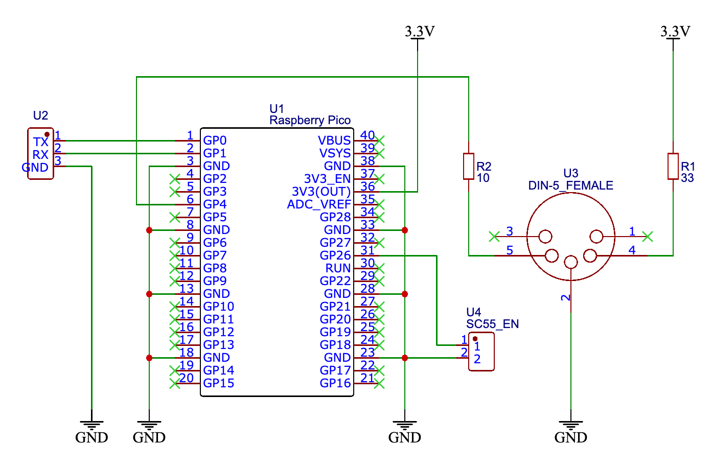

# Overview

Converts RS-MIDI signals (38400bps) to MIDI signals (31250bps).  
Supports SC-55 emulation for SC-55mkII or later.

## Signal flows

- RS-MIDI IN -> MIDI OUT
- RS-MIDI IN/OUT <-> USB-MIDI IN/OUT
- USB-MIDI OUT -> MIDI OUT (Loop back RS-MIDI TX and RX)

## SC-55 emulation

- Capital Tone Fallback
- TVF Cutoff Freq Limitation
- Force SC-55 map

# Hardware

## Schematics



## Jumpers

- SC55_EN
    - Enable SC-55 emulation immediately

## Details

https://oshwlab.com/hsshss/midi-rate-conv

# Building

```bash
git clone https://github.com/hsshss/midi-rate-conv.git
cd midi-rate-conv
docker build -t midi-rate-conv-builder .
docker run --rm -v ${PWD}:/app -t midi-rate-conv-builder sh -c "mkdir -p build && cd build && cmake -DCMAKE_BUILD_TYPE=Release .. && cmake --build ."
```

# Flashing

1. Disconnect all connectors
2. While holding down the BOOTSEL button and connect to PC with USB cable
3. A USB Mass Storage Device named `RPI-RP2` will be mounted
4. Drag and drop `midi-rate-conv.uf2` file to the `RPI-RP2`
